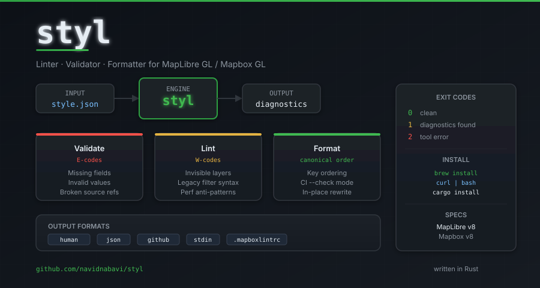

# styl

**Linter, validator, and formatter for MapLibre GL / Mapbox GL style JSON.**  
Catch spec violations, enforce best practices, and keep style files consistent — in CI or locally.



[](https://github.com/navidnabavi/styl/actions/workflows/rust.yml)
[](https://www.rust-lang.org)
[](LICENSE)
[](https://maplibre.org/maplibre-style-spec/)

---

## Why styl?

GL style JSON files grow fast. A single typo in a source reference silently breaks tiles. An invisible layer left in production wastes render time. Legacy filter syntax slips through code review unnoticed.

`styl` is the `cargo clippy` for your map styles — runs in milliseconds, integrates with CI, and tells you exactly what is wrong and why.

```
$ styl check style.json

warning[W002] layers[9].layout.visibility: layer "Building" is permanently invisible
  --> style.json
  hint: remove the layer or set visibility to "visible" if it should be shown

warning[W011] layers[3].filter: layer "Landuse" uses deprecated legacy filter syntax
  --> style.json
  hint: migrate to expression-based filters: https://maplibre.org/maplibre-style-spec/expressions/

error[E003] sources.roads: vector source missing required field "url" or "tiles"
  --> style.json
```

---

## Features

| Feature | Description |
|---|---|
| **Validator** | Spec violations: missing fields, invalid values, broken source refs (E-codes) |
| **Linter** | Best-practice warnings: duplicate IDs, invisible layers, legacy filters, perf anti-patterns (W-codes) |
| **Formatter** | Canonical key ordering with `--check` mode for CI enforcement |
| **Multiple output formats** | Human-readable, JSON (for tooling), GitHub Actions annotations |
| **Config file** | Per-project `.stylrc` — per-rule severity overrides, indent settings |
| **Stdin support** | `cat style.json \| styl check --stdin` — pipe-friendly |

---

## Installation

### Homebrew (macOS / Linux)

```bash
brew tap navidnabavi/tap
brew install styl
```

### One-line installer

```bash
curl -fsSL https://raw.githubusercontent.com/navidnabavi/styl/main/install.sh | bash
```

Detects your OS and architecture, downloads the correct binary, installs to `/usr/local/bin`.

### Cargo (requires Rust)

```bash
cargo install --git https://github.com/navidnabavi/styl
```

### Build from source

```bash
git clone https://github.com/navidnabavi/styl
cd styl
cargo build --release
# binary at: target/release/styl
```

---

## Usage

```bash
styl check style.json                     # validate + lint (most common)
styl validate style.json                  # spec violations only (E-codes)
styl lint style.json                      # best-practice warnings only (W-codes)
styl fmt style.json                       # format in-place
styl fmt --check style.json               # CI: exit 1 if formatting would change
styl check --format json style.json       # machine-readable output
styl check --format github style.json     # GitHub Actions annotations
cat style.json | styl check --stdin       # read from stdin
```

### Exit Codes

| Code | Meaning |
|------|---------|
| `0` | Clean — no diagnostics |
| `1` | Diagnostics found (errors or warnings) |
| `2` | Tool error (bad JSON, I/O failure) |

### CI Integration

**GitHub Actions (simple, always latest):**
```yaml
- name: Install styl
  run: curl -fsSL https://raw.githubusercontent.com/navidnabavi/styl/main/install.sh | bash
- name: Check styles
  run: styl check --format github style.json
```

**GitHub Actions (pinned version + checksum — recommended for production):**

Replace `VERSION` and `SHA256` with values from the [latest release](https://github.com/navidnabavi/styl/releases/latest) — each release ships a `.sha256` file alongside the binary.

```yaml
- name: Install styl
  env:
    VERSION: v0.0.3  # pin to a specific release
  run: |
    curl -fsSL https://github.com/navidnabavi/styl/releases/download/${VERSION}/styl-${VERSION}-x86_64-unknown-linux-gnu -o styl
    curl -fsSL https://github.com/navidnabavi/styl/releases/download/${VERSION}/styl-${VERSION}-x86_64-unknown-linux-gnu.sha256 | sha256sum -c
    chmod +x styl && sudo mv styl /usr/local/bin/
- name: Check styles
  run: styl check --format github style.json
```

**Pre-commit hook:**
```bash
styl fmt --check style.json && styl check style.json
```

---

## Configuration

Drop a `.stylrc` at your project root:

```toml
[rules]
W002 = "error"   # invisible layers → hard error
W003 = "off"     # unused layers → silence
W011 = "warn"    # legacy filters → warn (default)

[format]
indent = 4
```

`styl` walks up the directory tree to find it automatically.

---

## Documentation

| Document | Description |
|----------|-------------|
| [CLI Reference](docs/cli.md) | All subcommands and flags |
| [Validators](docs/validators.md) | E-code spec violations |
| [Linter Rules](docs/linter.md) | W-code best-practice warnings |
| [Expressions](docs/expressions.md) | Supported expression operators |
| [Formatter](docs/formatter.md) | Key ordering and `--check` mode |
| [Configuration](docs/config.md) | `.stylrc` reference |
| [Layer Properties](docs/layer-properties.md) | Valid paint/layout props per layer type |

---

## Supported Specs

- **MapLibre GL Style Spec v8** (default) — [maplibre.org/maplibre-style-spec](https://maplibre.org/maplibre-style-spec/)
- **Mapbox GL Style Spec v8** — pass `--spec mapbox`

---

## Contributing

See [CONTRIBUTING.md](CONTRIBUTING.md). New validators and linter rules are welcome — the architecture makes adding them straightforward.

```bash
cargo build && cargo test && cargo clippy -- -D warnings && cargo fmt --check
```

All four must pass before opening a PR.

---

## License

MIT
